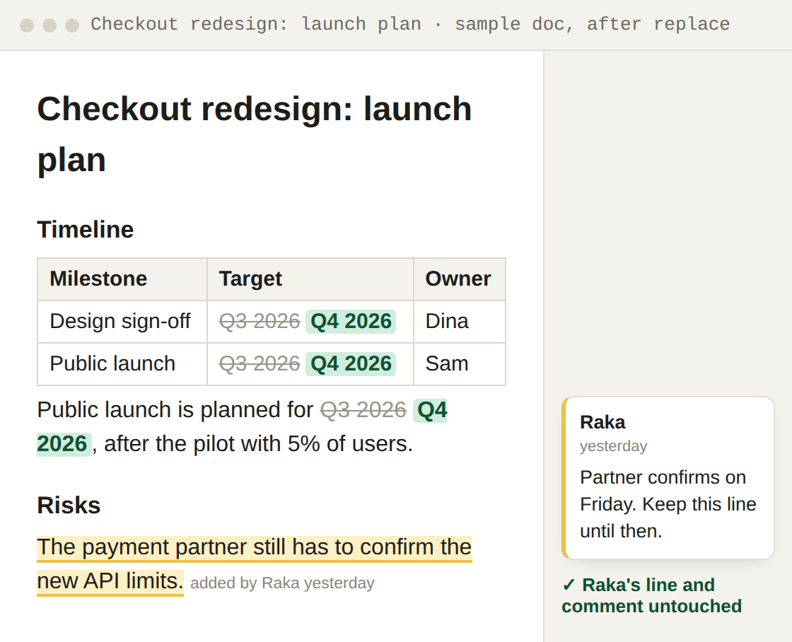

<div align="center">

# gdoc-surgical

**AI rewrote your whole Google Doc and wiped your teammate's edits? This edits only the part you name.**

[](LICENSE)
[](docs/setup.md#use-it-as-an-agent-skill)

</div>


## Why

- You ask AI to update a shared PRD. It writes a new copy of the whole document.
- A teammate's edit from this afternoon is gone, and nobody gets a warning.
- Comments come loose, images go missing, and AI still says "done".

## What it does

- **Changes only the sentence, table row or cell you name.** Everything else in the doc stays as it was.
- **Keeps other people's work:** their edits, comments, suggestions, images and sharing. Only a comment pinned to the exact text you change can come loose.
- **Refuses to guess.** If the text it should change is not there, nothing changes and it tells you.
- **Works on tables too.** Change one cell or add one row, and the rest of the table stays as it was.
- **Works from plain words.** Ask your AI agent, for example Claude Code, and it runs the commands.


*Real output, recorded offline against a sample doc: [docs/src/offline_demo.py](docs/src/offline_demo.py) runs the same commands with no Google account.*

## Quick start

Sign in to Google once with `client_secret.json` (needs a free Google Cloud OAuth client, about 10 minutes: [setup guide](docs/setup.md)).

```bash
# 1. Install
git clone https://github.com/BrianArfi/gdoc-surgical
cd gdoc-surgical
pip install -r requirements.txt

# 2. Sign in to Google once
python3 gdoc_surgical.py auth --credentials client_secret.json

# 3. Make one edit
python3 gdoc_surgical.py replace --id DOC_ID --find "Q3 2026" --with "Q4 2026"
```

No Google account yet? Try it offline first:

```bash
python3 docs/src/offline_demo.py read --id DEMO_DOC
python3 docs/src/offline_demo.py replace --id DEMO_DOC --find "Q3 2026" --with "Q4 2026"
python3 tests/test_gdoc_surgical.py   # every guard, against a fake document
```

## Example

Move a launch from Q3 to Q4 in a shared launch plan, without touching the line a teammate just added:

```text
$ python3 gdoc_surgical.py replace --id DOC_ID --find "Q3 2026" --with "Q4 2026"
[OK] Replaced 3 occurrence(s). Doc: https://docs.google.com/document/d/DOC_ID/edit
```



*Illustration with a sample document; the output lines are the tool's real format.*

---

## Documentation

- [Why gdoc-surgical](docs/why.md): the problem, the fix, and who it is for
- [How it works](docs/how-it-works.md): the read, check, edit flow, the guards, and what it does not do
- [Commands, flags and exit codes](docs/commands.md): all nine editing commands
- [Setup, auth and requirements](docs/setup.md): Google sign-in, several accounts, agent skill install, tests
- [SKILL.md](SKILL.md): the rules an AI agent follows when it uses this tool
- [Skill page with examples](https://brianarfi.com/skills/gdoc-surgical?utm_source=github&utm_medium=readme&utm_campaign=ai-skills)

## FAQ

**Do I need to code?**
A little, once. The setup is a few terminal commands. After that you can ask your AI, for example Claude Code, in plain words, and it runs the commands.

**Where does my document go?**
Nowhere new. The tool runs on your computer and talks directly to Google with your own account. It has no server of its own. Your token stays in a local file.

**What if someone edits while the AI is working?**
Positions in the document can shift. That is why `delete-row` must name text that is in the row, and `set-cell` can do the same. If the text is not there, nothing changes and the command exits 2. Read the document again and retry.

**Can it create a document, rewrite one, or handle comments?**
No. It only edits documents that already exist, one targeted change at a time. It does not create documents, rewrite a whole document, or read or resolve comments.

**Can it bring back an edit that another tool already deleted?**
No. It prevents the overwrite, it does not undo one. Google Docs keeps its own version history under **File, Version history**, and that is where to look.

## Changelog

The full history is in [CHANGELOG.md](CHANGELOG.md), newest first. Latest release: 1.0.0 (2026-09-22). `python3 gdoc_surgical.py --changelog` prints the same list.

## License

Apache-2.0. See [LICENSE](LICENSE) and [NOTICE](NOTICE).

More AI skills: https://brianarfi.com/skills
