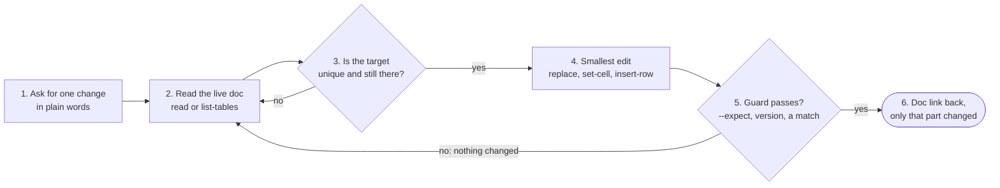

# gdoc-surgical

**Let AI update your Google Doc without erasing anyone else's work.**

Most tools that write to a Google Doc replace the whole document. An edit somebody made since your last read is not merged, it is deleted, and nobody gets a warning. gdoc-surgical changes only the sentence, table row or cell you name, and leaves everything outside that part alone: other people's edits, comments, suggestions, images and sharing. A comment anchored to the exact text you change can still come loose.

[](LICENSE)
[](CHANGELOG.md)
[](#use-it-as-an-agent-skill)


*Illustration with a sample document; the output lines are the tool's real format.*

## The shift: AI now writes your documents

PRDs, proposals, SOPs. You say what changed, and AI does the writing. That works well in a file only you own. A shared Google Doc is different: people edit it between the moment AI reads it and the moment AI writes. So the AI needs a way to change one part, not the whole document.

| Task | What AI now does | What you say |
| :--- | :--- | :--- |
| Update a PRD | AI rewrites the section you asked about | "Move the launch to Q4 and add a v1.3 row" |
| Keep a sign-off table | AI marks each approval as it comes in | "Mark the design review as Approved" |
| Link tickets across a doc | AI adds the link wherever the ticket is named | "Link every mention of the Q3 Roadmap" |
| Log a decision | AI adds the entry at the end of the doc | "Add today's decision to the decision log" |

## The gap: AI rewrites the whole shared doc

- AI updates the PRD in the morning. In the afternoon a teammate asks, "Where did my edit go?"
- Your review comments come loose from the text they were on.
- An image in the document is gone after the update. Nobody gets a warning.
- AI says "done", but the word it looked for was not in the document.
- A revision table gets a v1.2 row under v1.3, and nobody notices.

The faster AI updates a shared document, the more of other people's work it can remove.

## The fix: edit only the part you name

gdoc-surgical sends small, targeted edits through the Google Docs API. It never uploads a new copy of the document. The commands that target a position have a guard: set-cell and delete-row check the expected text, and insert-row and set-cell refuse a version that goes backwards. replace and linkify fail with exit code 2 when nothing matched. When a guard fails, nothing changes and the command exits with a non-zero code.

| Before | After |
| :--- | :--- |
| AI rewrites the whole document | AI changes only the part you name |
| Yesterday's edits from a teammate get overwritten | Other people's writing stays intact |
| AI says "done", but the text it looked for was not there | Zero matches is reported as a failure, exit code 2 |
| A version number goes backwards and nobody notices | Version numbers in a revision table can only go up |

## Who it is for

People who let an AI agent, such as Claude Code, keep shared Google Docs up to date: product managers with PRDs, team leads with SOPs, consultants with client proposals, anyone who keeps a revision table or a sign-off table. It also suits anyone who scripts changes to a live document that other people edit at the same time. You run a one-time setup in a terminal. After that, you ask your AI in plain words.

## How it works



1. **Ask for one change.** Tell your AI what to change, in plain words: "Change the public launch target from Q3 2026 to Q4 2026."
2. **Read the live document.** Not a local copy, and not the version from earlier in the conversation. `read` prints every paragraph with its index, and `list-tables` prints every table with its header row.
   ```bash
   python3 gdoc_surgical.py read --id DOC_ID
   python3 gdoc_surgical.py list-tables --id DOC_ID
   ```
3. **Make sure the target is unique.** `replace` hits every occurrence. If the find-string is short or common, make it longer until only your target matches. For one table cell, use `set-cell`.
4. **Write the smallest edit that does the job.**
   ```bash
   python3 gdoc_surgical.py replace --id DOC_ID --find "planned for Q3 2026" --with "planned for Q4 2026"
   ```
5. **Let the guard decide.** An `--expect` mismatch or a version regression stops the write. A replace that matched nothing exits 2. Read the document again, then retry.
   ```bash
   python3 gdoc_surgical.py delete-row --id DOC_ID --table 0 --row 3 --expect "the draft row"
   ```
6. **Open the link.** Every success line ends with the document link. A write with no document id in the response is reported as a failure.


*Illustration of the sample document after the replace above.*

## What it can do

| Command | What you get | Use it for |
| :--- | :--- | :--- |
| `read` | The document as text, each paragraph with its start and end index, each table as `<TABLE #n: rows x cols>` | Finding the exact target before any write |
| `list-tables` | Every table with its index, size, start index and header row | Picking the right `--table` number |
| `replace` | Every occurrence of exact text replaced, body and table cells. Prints the body-paragraph count before it writes, the total changed after, and exits 2 on zero | Renaming a feature across a doc. Moving a target date |
| `linkify` | Every occurrence hyperlinked, including inside table cells. Only the link style changes, never the words. Exits 2 when the text is not found | Linking tickets or a roadmap wherever they are named |
| `append` | New lines at the end. `#` to `####` become headings, `-` or `*` become bullets, the rest is normal text | A weekly update. A decision log entry |
| `insert-table` | A new table at the end, filled row by row from `--rows "a\|b\|c"` flags | A new status table or a risk table |
| `insert-row` | One row inserted below a given row (default: the last row) and filled from `--cells`. A version in the first cell must be higher than every version already in that column | A revision table row. A new line in a tracker table |
| `set-cell` | One cell replaced by row and column. With `--expect`, it changes only if the cell still holds that text | Marking an approval in a sign-off table. Updating one status |
| `delete-row` | One row deleted. `--expect` is mandatory, and the row must contain it | Removing an old draft row |

One Python file, no framework. The only configuration is a Google sign-in.

## Quick start

**1. Get the code and install the two Google libraries.**

```bash
git clone https://github.com/BrianArfi/gdoc-surgical
cd gdoc-surgical
pip install -r requirements.txt
```

**2. Create an OAuth client.** In the Google Cloud Console, open **APIs and Services, Credentials, Create credentials, OAuth client ID, Desktop app**, and download the JSON as `client_secret.json`. Enable the **Google Docs API** and the **Google Drive API** on the same project.

**3. Sign in once.** A browser opens for the Google sign-in.

```bash
python3 gdoc_surgical.py auth --credentials client_secret.json
```

**4. Read a document.** The document id is the long string in the doc URL, between `/d/` and `/edit`.

```bash
python3 gdoc_surgical.py read --id DOC_ID
```

**5. Make one edit.**

```bash
python3 gdoc_surgical.py replace --id DOC_ID --find "Q3 target" --with "Q4 target"
```

### Try it first

No Google account and no network needed:

```bash
python3 tests/test_gdoc_surgical.py
python3 gdoc_surgical.py --version
```

The tests run the request builders and the guards against a fake document. For a first real edit, make a copy of a document (**File, Make a copy**) and point the commands at the copy.

## Why the guards are the point

Every destructive command targets an index, and indexes move the moment somebody else edits the document. So each one refuses to guess:

- **`delete-row` wants `--expect`, and `set-cell` takes it.** It is text that must already be in the target. A shifted index then fails loudly instead of quietly editing the wrong row. This is what makes the tool safe to run unattended. `delete-row` refuses to run without it.
- **`replace` reports the occurrence count before it writes**, and exits 2 when it changed nothing. A silent zero-match usually means the wording is not what you remembered. The pre-write count covers body paragraphs only. The replace itself also hits table cells, and the `[OK]` line reports the true total.
- **Revision tables cannot go backwards.** `insert-row`, and `set-cell` on column 0, check the first cell against every version already in the first column of that table. Writing `v1.2` into a table that already has `v1.3` is refused, and the message names the next valid number. A version number that goes backwards is invisible: the row looks right and the reader trusts a version that is older than the text above it. Override with `--allow-version-regression`, only for a deliberate duplicate. The check reads `major.minor` tokens such as `v1.3` or `1.3`, and a table without them passes through.
- **Every write is verified.** An API response with no document id in it is reported as a failure, never as a quiet success.

## Commands and flags

```bash
python3 gdoc_surgical.py read         --id DOC_ID
python3 gdoc_surgical.py list-tables  --id DOC_ID
python3 gdoc_surgical.py replace      --id DOC_ID --find "old text" --with "new text" [--match-case]
python3 gdoc_surgical.py linkify      --id DOC_ID --find "Q3 Roadmap" --url "https://..."
python3 gdoc_surgical.py append       --id DOC_ID --text '## Heading\n- a bullet\nplain line'
python3 gdoc_surgical.py insert-table --id DOC_ID --rows "Header A|Header B" --rows "1|2"
python3 gdoc_surgical.py insert-row   --id DOC_ID --table 0 --cells "v1.3|2026-09-22|Sam|Added the refund rule"
python3 gdoc_surgical.py set-cell     --id DOC_ID --table 0 --row 2 --col 1 --with "Approved" --expect "Pending"
python3 gdoc_surgical.py delete-row   --id DOC_ID --table 0 --row 3 --expect "text in that row"
```

| Flag | Used by | Meaning |
| :--- | :--- | :--- |
| `--id` | every command except `auth` | The Google Doc id |
| `--find`, `--with` | `replace` (both), `linkify` (`--find`), `set-cell` (`--with`) | Exact text to find, and the new text |
| `--match-case` | `replace` | Case-sensitive match. Default is case-insensitive |
| `--url` | `linkify` | The link target |
| `--text` | `append` | Text to add. `\n` for a new line, `#` for a heading, `-` for a bullet |
| `--table` | `insert-row`, `set-cell`, `delete-row` | 0-based table index, from `list-tables`. Default 0 |
| `--row` | `insert-row`, `set-cell`, `delete-row` | 0-based row. For `insert-row`, the new row goes below it, and -1 means the last row. Mandatory for `set-cell` and `delete-row` |
| `--col` | `set-cell` | 0-based column. Default 0 |
| `--cells` | `insert-row` | Pipe-separated values. Extra values beyond the column count are dropped with a warning |
| `--rows` | `insert-table` | One pipe-separated row per flag, repeated |
| `--expect` | `set-cell` (optional), `delete-row` (mandatory) | Text that must already be in the target |
| `--allow-version-regression` | `insert-row`, `set-cell` | Permit a version at or below one already in the table |
| `--version`, `--changelog [list\|full]` | none | Print the version, or the bundled changelog |

**Exit codes.** `0` success. `1` an error: no token, a table or row out of range, a write with no document id, or a refused version. `2` nothing matched: zero replacements, `linkify` text not found, or an `--expect` mismatch. In every non-zero case except a failed write response, the document is unchanged. `insert-row` inserts the row first and fills it second. If the fill fails, an empty row remains. `insert-table` works the same way.

`replace` or `set-cell`? `replace` is global. It cannot safely target a cell whose whole content is a common string: a version cell reading `1.4` would also rewrite every `1.4` in the changelog. Address that cell by coordinate with `set-cell`.

## Auth

The token lands in `~/.config/gdoc-surgical/default.json` and refreshes itself. The token file is written with owner-only permissions where the OS supports it.

- **Several accounts:** `--account work` writes and reads `work.json`. Every command takes the same flag.
- **A token file elsewhere:** `--token /path/to/token.json` overrides `--account`. The `GDOC_SURGICAL_TOKEN` environment variable does the same.
- **A different config folder:** set `GDOC_SURGICAL_HOME`.
- **A token from another tool:** a Drive-scoped token issued by another tool works here. The Docs API accepts it.

The sign-in asks for the Google Drive scope (`https://www.googleapis.com/auth/drive`), so the token can edit any document your account can edit.

**Timeout.** On macOS and Linux, a run stops after 180 seconds so it cannot hang on the API. Change it with `GDOC_SURGICAL_TIMEOUT` (seconds). The timeout uses a Unix signal, so it does not apply on Windows.

## Use it as an agent skill

`SKILL.md` carries the rules of engagement in the format that Claude Code and similar harnesses read. Copy the directory into your skills folder:

```bash
cp -r gdoc-surgical ~/.claude/skills/
```

The rule that matters for an agent: read the live document before writing to it. A version number or a changelog row is not a substitute, because somebody can edit a document without touching either.

## What it does not do

- **Create a document.** It edits documents that already exist.
- **Rewrite a whole document.** If that is what you want, you are choosing to delete other people's edits, so say that out loud first.
- **Read or resolve comments.** That is a different API surface.
- **Recover a lost edit.** If an overwrite already happened elsewhere, use Google Docs' own **File, Version history** to look for the earlier text. This tool does not read or restore revisions.

## Tests

```bash
python3 tests/test_gdoc_surgical.py
```

No network and no credentials. The request builders and the guards are pure functions over plain dicts, so a fake document stands in for a real one.

## Requirements

- **Python 3** with `pip`.
- **Two libraries:** `google-api-python-client` 2.0 or later and `google-auth-oauthlib` 1.0 or later, from `requirements.txt`.
- **A Google Cloud project** with the Google Docs API and the Google Drive API enabled, and an OAuth client of type Desktop app.
- **Edit access** to the document you want to change.
- **Optional:** Claude Code or a similar AI agent, to drive the commands from plain-language requests.

## FAQ

**Do I need to code?**
A little, once. The setup is a few terminal commands. After that you can ask your AI, for example Claude Code, in plain words, and it runs the commands.

**Where does my document go?**
Nowhere new. The tool runs on your computer and talks directly to Google with your own account. It has no server of its own. Your token stays in a local file.

**What if someone edits while the AI is working?**
Positions in the document can shift. That is why `delete-row` must name text that is in the row, and `set-cell` can do the same. If the text is not there, nothing changes and the command exits 2. Read the document again and retry.

**Can it create a document, rewrite one, or handle comments?**
No. It only edits documents that already exist, one targeted change at a time. It does not create documents, rewrite a whole document, or read or resolve comments.

**Can it bring back an edit that another tool already deleted?**
No. It prevents the overwrite, it does not undo one. Google Docs keeps its own version history under **File, Version history**, and that is where to look.

## Changelog

The full history is in [CHANGELOG.md](CHANGELOG.md), newest first. **Latest release: [1.0.0] - 2026-09-22**, the first public cut: the nine editing commands, named token profiles, the `--expect` and zero-match guards, the revision-table version guard, verified writes, `SKILL.md` and offline tests. Unreleased since then: `--version` and `--changelog`, and the changelog file itself.

The CLI reads the same file:

```bash
python3 gdoc_surgical.py --version            # gdoc-surgical 1.0.0
python3 gdoc_surgical.py --changelog          # list of versions
python3 gdoc_surgical.py --changelog full     # the whole changelog
```

## License

Apache-2.0. See [LICENSE](LICENSE) and [NOTICE](NOTICE).

## More AI Skills

gdoc-surgical is one of the AI skills Brian Arfi uses every day and shares. See the page for this skill, with examples, at [brianarfi.com/skills/gdoc-surgical](https://brianarfi.com/skills/gdoc-surgical?utm_source=github&utm_medium=readme&utm_campaign=ai-skills), and the rest at [brianarfi.com/skills](https://brianarfi.com/skills?utm_source=github&utm_medium=readme&utm_campaign=ai-skills).
