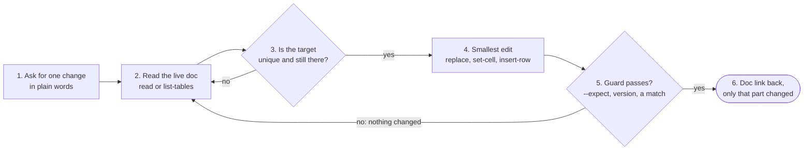

# How it works

[Back to README](../README.md)

## The flow



1. **Ask for one change.** Tell your AI what to change, in plain words: "Change the public launch target from Q3 2026 to Q4 2026."
2. **Read the live document.** Not a local copy, and not the version from earlier in the conversation. `read` prints every paragraph with its index, and `list-tables` prints every table with its header row.
   ```bash
   python3 gdoc_surgical.py read --id DOC_ID
   python3 gdoc_surgical.py list-tables --id DOC_ID
   ```
3. **Make sure the target is unique.** `replace` hits every occurrence. If the find-string is short or common, make it longer until only your target matches. For one table cell, use `set-cell`.
4. **Write the smallest edit that does the job.**
   ```bash
   python3 gdoc_surgical.py replace --id DOC_ID --find "planned for Q3 2026" --with "planned for Q4 2026"
   ```
5. **Let the guard decide.** An `--expect` mismatch or a version regression stops the write. A replace that matched nothing exits 2. Read the document again, then retry.
   ```bash
   python3 gdoc_surgical.py delete-row --id DOC_ID --table 0 --row 3 --expect "the draft row"
   ```
6. **Open the link.** Every success line ends with the document link. A write with no document id in the response is reported as a failure.


*Illustration of the sample document after the replace above.*

## Why the guards are the point

Every destructive command targets an index, and indexes move the moment somebody else edits the document. So each one refuses to guess:

- **`delete-row` wants `--expect`, and `set-cell` takes it.** It is text that must already be in the target. A shifted index then fails loudly instead of quietly editing the wrong row. This is what makes the tool safe to run unattended. `delete-row` refuses to run without it.
- **`replace` reports the occurrence count before it writes**, and exits 2 when it changed nothing. A silent zero-match usually means the wording is not what you remembered. The pre-write count covers body paragraphs only. The replace itself also hits table cells, and the `[OK]` line reports the true total.
- **Revision tables cannot go backwards.** `insert-row`, and `set-cell` on column 0, check the first cell against every version already in the first column of that table. Writing `v1.2` into a table that already has `v1.3` is refused, and the message names the next valid number. A version number that goes backwards is invisible: the row looks right and the reader trusts a version that is older than the text above it. Override with `--allow-version-regression`, only for a deliberate duplicate. The check reads `major.minor` tokens such as `v1.3` or `1.3`, and a table without them passes through.
- **Every write is verified.** An API response with no document id in it is reported as a failure, never as a quiet success.

## What it does not do

- **Create a document.** It edits documents that already exist.
- **Rewrite a whole document.** If that is what you want, you are choosing to delete other people's edits, so say that out loud first.
- **Read or resolve comments.** That is a different API surface.
- **Recover a lost edit.** If an overwrite already happened elsewhere, use Google Docs' own **File, Version history** to look for the earlier text. This tool does not read or restore revisions.
